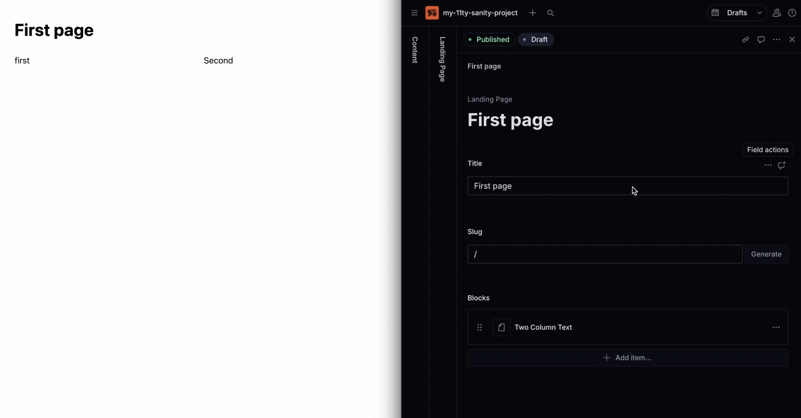

# Sanity + 11ty + Bootstrap

Make pages in Sanity. See them in 11ty. Ship fast.

## Requirements

- Node.js + npm
- Sanity CLI: `npm i -g @sanity/cli`
- PM2: `npm i -g pm2`

## Setup (one time)

1) Create a Sanity project (get your project ID).
2) In this repo, make a `.env`:
```
PROJECT_NAME="my-site"
SANITY_PROJECT_ID="your-sanity-project-id"
SANITY_DATASET="production"
```
3) Make scripts executable: `chmod +x generate.sh serve.sh stop.sh update.sh`
4) Log in: `sanity login`

## Usage

### Make a project
```
mkdir my-site && cd my-site
../sanity-11ty-bootstrap/generate.sh .
```

### Run it
```
../sanity-11ty-bootstrap/serve.sh .
```
- Site → http://localhost:8080
- Studio → http://localhost:3333

First run tip: In Studio, create and publish “Site Settings” to power the global header/footer.

### 3. Stop the Development Servers

To stop all running development servers, use the `stop.sh` script from your project's directory:

```bash
../sanity-11ty-bootstrap/stop.sh .
```

This will stop the `pm2` processes for the 11ty site, Sanity Studio, and the content listener.

### Update
From inside your project:
```
../sanity-11ty-bootstrap/update.sh .
```
Pick one:
- 1) Add new templates/pages/schemas (no overwrite) + data
- 2) Add + update templates/pages/schemas (overwrite) + data
- 3) Update scripts (eleventy config + listener)
- 4) Choose theme (copies to `web/src/assets/theme.css`)

### Demo

[](https://raw.githubusercontent.com/Miki-AG/sanity-11ty-bootstrap/main/demo.mp4)

## Technical Notes

- Portable Text: The site renders Sanity Portable Text via a Nunjucks filter `pt` registered in `web/.eleventy.js`. The helper lives in `web/src/_data/portableText.js`.
- Global header/footer: Fetched via `web/src/_data/globals.js` and injected by the base layout. Per‑page header blocks are not needed.
- Bootstrap Icons: Enabled via CDN in the base layout; use `<i class="bi bi-star-fill"></i>` or set `bi` field on featuresGrid items.
- CSS defaults: `web/src/assets/site.css` removes body margin, keeps header/footer full‑bleed, and provides light helpers for hero, features and cards.
- Live updates: `web/listen.js` listens for `landingPage`, `siteSettings`, `post`, `author`, and `category` changes and touches data files to trigger 11ty rebuilds (used by `serve.sh`).

### Blogging

- Create `Author`, `Category`, and `Post` documents in Sanity.
- Posts use the same Blocks system as landing pages, so you can mix richText, images, galleries, hero covers, etc.
- Per‑post pages render at `/blog/<slug>/`. The blog index paginates at `/blog/`.
- Category archives are available at `/blog/category/<slug>/` and a categories index at `/blog/categories/`.
- Editor notes: Posts include a rich‑text "Notes" field that is visible in Studio (for drafts and published posts) and never rendered on the site.

## Components

- heroCover: Big hero with optional background image (`bgImage`) and alignment.
- featuresGrid: Icon/text features in a responsive grid.
- cardsGrid: Image/title/text cards in a grid.
- pricingTable: Plans with features and CTA buttons.
- faqAccordion: Question/answer accordion.
- ctaBanner: Prominent call‑to‑action stripe.
- imageWithCaption: Single image with caption.
- twoColumnText: Two rich‑text columns.
- quotes: Left quotes + right image, title alignment optional.
- portfolio: Recent work list (30/70 thumb/text) + rich‑text side column, order toggle.
- richText: Single rich‑text block with left/right alignment.
- imageGallery: Horizontal gallery (equal widths), stacked on mobile.
- adjustableImage: Single image with desktop width %, left/center/right alignment, optional rich‑text caption; full‑width on mobile.

Themes
- Base layout links `/assets/theme.css` then `/assets/site.css`.
- Use `update.sh` option 4 to copy a theme (minimalistic, indigo‑pink, pink‑bluegray).
- Themes expose Bootstrap CSS variables (colors, typography) and container max‑widths per breakpoint.
